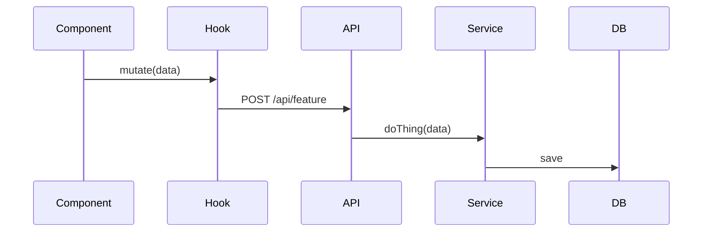

# Planning Guidelines

How to write an implementation plan for Pick Flick.

Store plans in `.ai/plans/<feature>/<git_username>/<feature>-plan.md`.

---

## Rules

1. **Discuss before writing.** Agree on scope first. Capture scope decisions in the plan, not just in conversation.

2. **Structure over prose.** Tables, file trees, bullet points. Short prose only for a component intro or a scope note.

3. **Diagrams:** mermaid for flows and state machines; ASCII trees for file/folder structure only.

4. **No marketing prose.** Plans describe decisions. Drop: flowery section names, hedging, narrative framing. Keep: plain names, direct descriptions, exact technical terms.

5. **Label operation status.** Every operation in a component table must carry: `new`, `keep`, or `refactor`.

6. **Pin what stays unchanged.** An explicit "stays unchanged" note per component keeps scope honest.

7. **Design artifacts belong in the plan. Implementation does not.** Include: Mongoose schemas (full fields, types, indexes), Zod schema shapes, service function signatures, hook signatures, component prop types, usage examples. Never include: full function bodies, algorithm walkthroughs.

8. **Cleanup phase always present.** Every plan touching existing code must have a final phase that removes old code and updates imports.

---

## Template

```
src/
  app/api/{feature}/      ← new route handler(s)
  components/{feature}/   ← new UI components
  hooks/use-{feature}.ts  ← new React Query hook
  services/{feature}.service.ts
  dtos/
    request/{feature}.req.dto.ts
    response/{feature}.res.dto.ts
  infrastructure/db/models/{feature}.model.ts  ← if new model needed
```

---

````markdown
# [Feature Name] Plan

## 1. Architecture

### 1.1 Overview

2–3 sentences. What problem this solves and why it belongs here.

### 1.2 Goals

- Outcome 1
- Outcome 2

### 1.3 Current Structure _(skip for greenfield)_

File tree of what exists today that this plan touches.

### 1.4 Target Structure

File tree with one-line purpose per file.

### 1.5 Flow _(skip if trivial)_

Mermaid sequence or state diagram for non-trivial data flows.



### 1.6 Components

A component is any logical unit being added or changed: a service function, an API route, a hook, a Mongoose model, a UI component, a DTO, a config change.

**Order:** Data Models first (1.6.1) if the plan touches the DB. Components start at 1.6.2 (or 1.6.1 if no data models).

#### 1.6.1 Data Models _(when DB is touched)_

One sub-section per Mongoose model or Zod schema that persists data.

##### 1.6.1.1 `FeatureModel`

One-line purpose.

```ts
const featureSchema = new Schema({
  userId: { type: String, required: true, index: true },
  // full field list with types, required flags, indexes
});
```

#### 1.6.2 [Component Name]

Short description. What it does and what it explicitly does NOT do.

**Operations:**

| Operation | Status | Notes |
|---|---|---|
| `doThing()` | new | Main entry |

**Signatures:**

```ts
// service
export async function doThing(params: { userId: string; data: string }): Promise<Result>

// hook
export function useFeature(): UseQueryResult<Result>

// API route: POST /api/feature
// body: FeatureRequestSchema
// response: FeatureResponseSchema
```

**Stays unchanged:** list any existing code this component touches but does not modify.

**Usage example:**

```ts
const { data } = useFeature();
```

### 1.7 Dependencies & Env _(skip if none)_

New packages or env vars introduced.

| Variable | Purpose |
|---|---|
| `NEXT_PUBLIC_ENABLE_X` | Toggle feature client-side |

---

## 2. Instructions for AI

### 2.1 Phases

#### 2.1.1 Phase 1: [Name]

- Step 1
- Step 2

#### 2.1.N Final Phase: Cleanup

- Remove replaced code
- Update imports
- Run `npm run lint` and `npm run build`

### 2.2 Before Implementing _(skip if nothing to clarify)_

- [ ] Confirm [assumption] with user before writing code

### 2.3 Acceptance Criteria _(skip when Goals are measurable)_

- [ ] Observable behavior A happens when X
- [ ] Edge case Y is handled as specified
````
